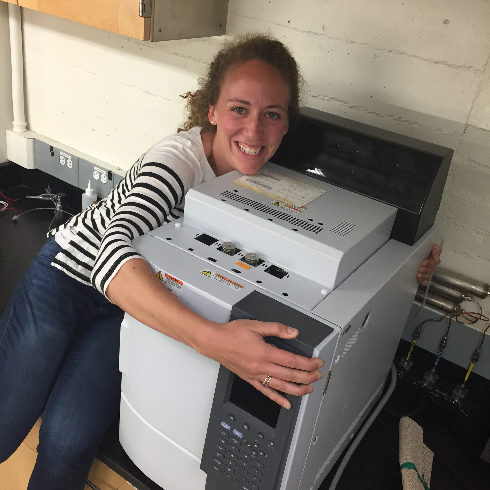
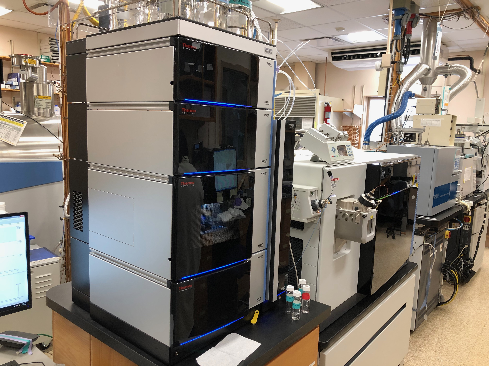
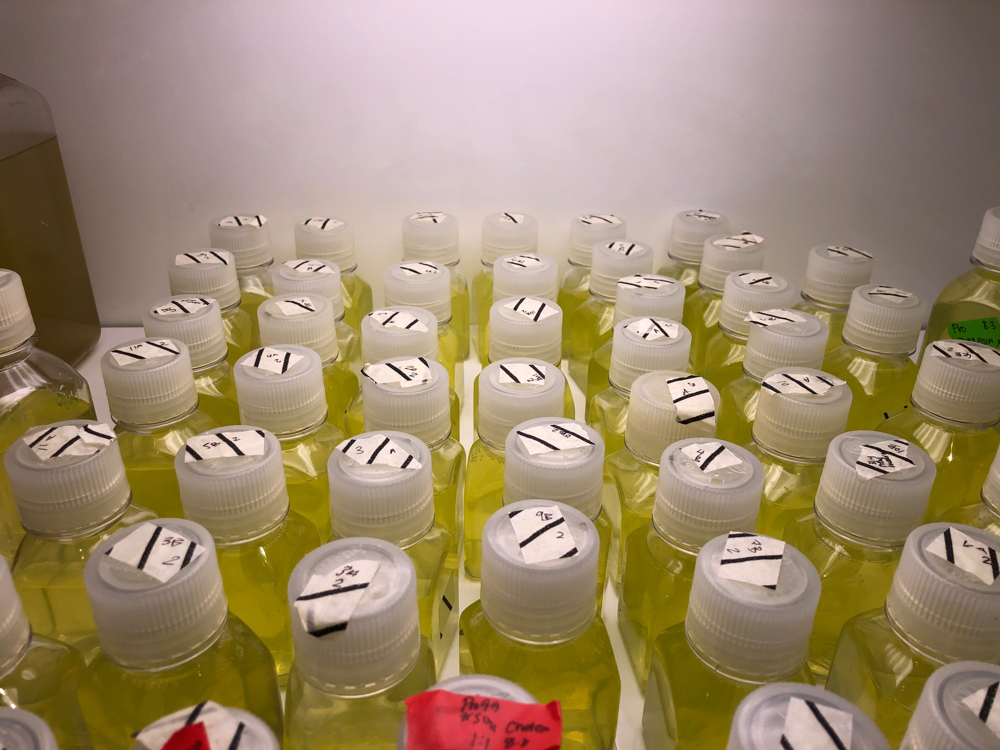

```{r setup, include=FALSE}
knitr::opts_chunk$set(echo = FALSE, fig.align = "center")
```


```{r out.width ="50%", echo=FALSE, fig.cap="The gas chromatograph I used throughout my PhD to measure dimethylsulfide (DMS)"}

```

```{r, out.width= "50%", echo =FALSE, fig.cap = "High-resolution mass spectrometer coupled to ultra-performance liquid chromatography at the WHOI FT Facility. This allows us to measure thousands of organic molecules within the complex soup of the ocean’s DOM."}

```

```{r, out.width= "50%", echo =FALSE, fig.cap = "I grow different isolates of marine photosynthesizers and heterotrophs to track the trading of metabolic products. Pictured here are many aliquots of *Prochlorococcus* needed to collect enough biomass for detection"}

```

