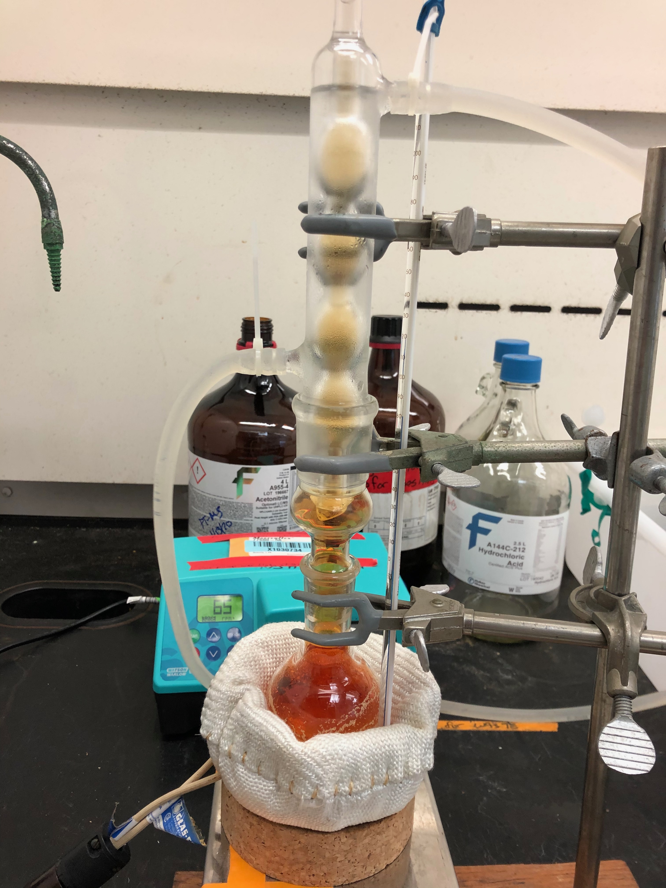
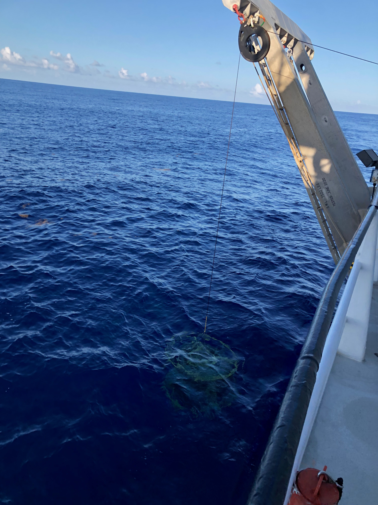
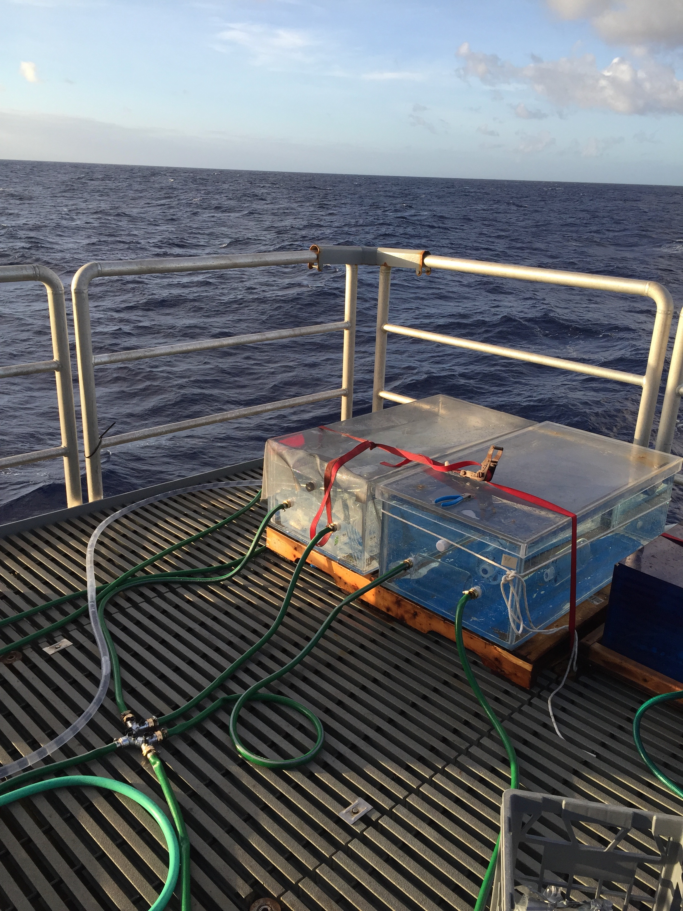

```{r setup, include=FALSE}
knitr::opts_chunk$set(echo = FALSE, fig.align = "center")
```

# Linking biogeochemistry of dissolved organic matter with microbial metabolism
Marine dissolved organic matter (DOM) is a heterogenous soup comprised of thousands of diverse organic molecules that serves as a critical control on Earth’s climate system through carbon storage, biogeochemical cycling, and fueling microbial activity. The fate of carbon and other macronutrients stored in DOM molecules is tightly-regulated by a network of microbial-DOM interactions that regulate DOM sequestration or return to the atmosphere as CO2. My research aims to quantify the composition and activity of DOM compounds that fuel the ecosystem functions of the marine microbial loop.

## Organic sulfur in the surface microbial loop
Heterotrophic communities are classically assumed to be energy (carbon) limited, but stratification is predicted to strengthen in a future warmer ocean and thus limit upwelling of nutrients. With my Simons Foundation Fellowship, I am developing a novel sulfur isotope probing method coupled to metabolomics measurements to investigate the preferential remineralization of sulfur from bulk DOM.

```{r out.width ="30%", echo=FALSE, fig.cap="Synthesizing 34S-labeled magnesium sulfate (MgSO4) for metabolomics tracer experiments"}

```

## Linking the diversity of DOM and the marine microbiome 
The diversity of DOM is equivalent or greater than the diversity of marine microbes responsible for recycling these molecules. During my WHOI Postdoctoral Scholarship, I analyzed the first depth-resolved untargeted metabolomics time-series to investigate the relationship of DOM and marine microbes. I found that seasonal DOM features are depth-specific, and critically, exhibit repeatable patterns across the three-year time-series. In comparison, marine microbes (ASVs) exhibited greater variability, suggesting that functional redundancy of the marine microbiome plays an important role in driving DOM composition.

```{r out.width ="30%", echo=FALSE, fig.cap="CTD surfacing at the Bermuda Atlantic Times-series Study (BATS) in the Sargasso Sea"}

```

## Physiological controls of organic matter production
Dimethylsulfoniopropionate (DMSP) is a labile DOM molecule that accounts for up to 5% of global marine photosynthesis, but the environmental drivers of DMSP production are unresolved. I found that in situ DMSP concentrations are controlled by two different producer phenotypes (high and low DMSP producers) for which DMSP serves different cellular mechanisms. In contrast to previous assumptions, my model output predicted that the abundance of high producers determines DMSP concentrations, not environmental stress, and using genomic analyses and 18S amplicon sequencing I demonstrated that two, evolutionarily-distinct DMSP synthesis genes can serve as biogeochemical marker genes. This work highlighted the influence of cellular-level metabolism on global scale dynamics, and the quantified mechanisms that regulate this ‘model’ labile molecule can be applied to similar molecules.
Currently I am a full member of the [DMS-PRO](https://scor-int.org/wp-content/uploads/2022/05/DMS-PRO_SCOR_WG_Proposal_2022.pdf) SCOR international working group that will improve understanding of rate measurements for the model metabolites DMS/P and other methylated sulfur compounds.

```{r out.width ="30%", echo=FALSE, fig.cap=" Incubators onboard the R/V Falkor testing DMSP stress responses of natural microbial communities"}

```
